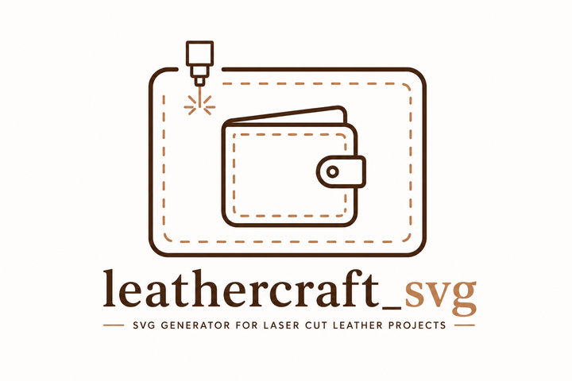
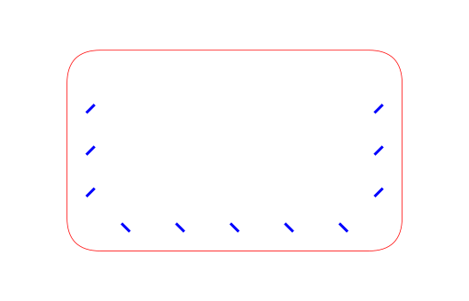
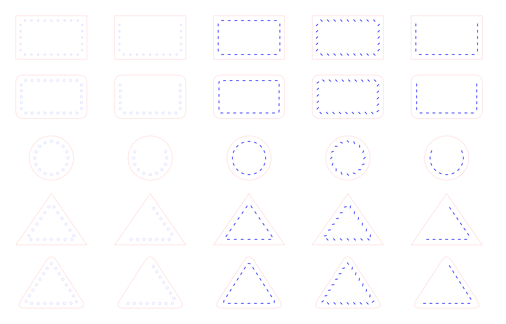

# leathercraft_svg



Library for generating simple SVG files for laser cutting, stitching, and scoring.
It supports shapes, edge points, stitching holes, PNG export with a white background,
and DXF export for CAD/CAM workflows.

Main features:

- no CSS in the generated SVG, styles are written inline on each element,
- layers: `cut`, `stitch`, `crease`, `guide`,
- automatic hole generation along shape edges,
- optional laser stitch pattern (short line segments) as an alternative to holes,
- SVG and PNG export,
- simple API built around geometry classes.

## Installation

The project uses Python 3.13+ and requires `cairosvg` for PNG export.
DXF export requires the optional `ezdxf` package.

```bash
python3 -m venv .venv
source .venv/bin/activate
pip install cairosvg ezdxf
```

If you only want to generate SVG, the library works without any extra packages.

## Quick Start

```python
from leathercraft_svg import Rectangle, SvgDocument

doc = SvgDocument(width_mm=100, height_mm=60)
shape = Rectangle(10, 10, 80, 40)

doc.add_shape(shape)
doc.add_holes(shape, spacing=8.0, hole_radius=1.2, inset=5.0)

doc.save("example.svg")
doc.save_png("example.png", background_color="white")
doc.save_dxf("example.dxf")
```

## Running the Examples

There is also a smaller focused example in `sample.py`:

```bash
./.venv/bin/python sample.py
```

This generates:

- `sample.svg`
- `sample.png`

The `sample.py` example shows a `RoundedRectangle` with a 45 degree stitch pattern on the right, bottom, and left edges:

```python
from leathercraft_svg import RoundedRectangle, SvgDocument


doc = SvgDocument(width_mm=140, height_mm=90)
shape = RoundedRectangle(20, 15, 100, 60, radius=10)

doc.add_shape(shape, layer="cut")
doc.add_stitch_pattern(
    shape,
    edges=[1, 2, 3],
    spacing=8.0,
    stitch_length=3.5,
    stitch_angle_deg=45.0,
    inset=7.0,
    layer="stitch",
    stitch_thickness=0.8,
)

doc.save("sample.svg")
doc.save_png("sample.png", background_color="white")
```

## Browser Editor

There are now two frontend modes:

- `python leathercraft_server.py` serves the existing Flask-backed editor at `/`
- the same server also serves a browser-only Pyodide editor at `/pyodide`

The Pyodide editor compiles `.lcraft` directly in the browser and supports
downloading `.lcraft` and `.svg` only. It does not offer PNG/PDF/DXF export.

Illustration:



There is also a broader gallery example in `all_shapes.py`:

```bash
./.venv/bin/python all_shapes.py
```

This generates:

- `all_shapes.svg`
- `all_shapes.png`

The `all_shapes.py` script renders a full overview of the supported shape variants and stitch or hole layouts.

Illustration:



For a scenario-by-scenario visual reference with code snippets and baseline images, see [VISUAL_TESTS.md](VISUAL_TESTS.md).

## SVG Format

The generated SVG:

- does not use CSS,
- writes colors, stroke width, and dash patterns directly on the elements,
- uses a `viewBox` aligned with the document size in millimeters,
- applies `vector-effect="non-scaling-stroke"`.

This improves compatibility with renderers that handle class-based styles poorly.

## Layers and Styles

Default layers are defined as:

- `cut` - red, `#ff0000`, width `0.1`
- `stitch` - blue, `#0000ff`, width `0.1`
- `crease` - green, `#00aa00`, width `0.1`, dash pattern `3 2`
- `guide` - gray, `#777777`, width `0.1`, dash pattern `2 2`

Every element added to the document can be assigned to one of these layers.

## API

### `SvgDocument(width_mm, height_mm, styles=None)`

Creates an SVG document.

Parameters:

- `width_mm` - document width in millimeters,
- `height_mm` - document height in millimeters,
- `styles` - optional `dict[str, StrokeStyle]` with custom styles.

If you do not pass `styles`, the default styles are used.

### `doc.add_shape(shape, layer="cut")`

Adds a shape as an SVG path.

Parameters:

- `shape` - an object that inherits from `Shape`,
- `layer` - target layer: `cut`, `stitch`, `crease`, or `guide`.

### `doc.add_path(d, layer="cut")`

Adds a raw SVG path.

Parameters:

- `d` - SVG path `d` attribute,
- `layer` - style layer.

### `doc.add_line(x1, y1, x2, y2, layer="cut")`

Adds an SVG line.

Parameters:

- `x1`, `y1` - start point,
- `x2`, `y2` - end point,
- `layer` - style layer.

### `doc.add_circle(x, y, radius, layer="cut")`

Adds an SVG circle.

Parameters:

- `x`, `y` - center,
- `radius` - radius,
- `layer` - style layer.

### `doc.add_holes(shape, edges="all", spacing=5.0, hole_radius=1.2, inset=4.0, layer="cut", include_corners=False)`

Adds holes computed from the edges of a shape.

Parameters:

- `shape` - shape that implements `hole_points()`,
- `edges` - which edges to use: `"all"` or a list of indices,
- `spacing` - distance between holes,
- `hole_radius` - radius of the holes,
- `inset` - distance from the edge,
- `layer` - layer for the holes,
- `include_corners` - if `True`, hole placement starts and ends at corners; if `False`, holes are offset from edge endpoints.

### `doc.add_stitch_holes(...)`

Alias for `add_holes(...)` with the same parameters.

### `doc.add_stitch_pattern(shape, edges="all", spacing=5.0, stitch_length=2.0, inset=4.0, layer="stitch", include_corners=False, stitch_thickness=None, stitch_angle_deg=0.0)`

Adds a laser stitch pattern (short line segments) on selected shape edges.

Parameters:

- `shape` - shape that implements `stitch_segments()`,
- `edges` - which edges to use: `"all"` or a list of indices,
- `spacing` - distance between stitches,
- `stitch_length` - length of each stitch segment,
- `inset` - distance from the edge,
- `layer` - layer for the stitches,
- `include_corners` - whether stitches are also placed at corners,
- `stitch_thickness` - optional per-pattern stroke width override (if `None`, the layer default is used).
- `stitch_angle_deg` - stitch tilt angle in degrees (default `0.0` = flat, custom values allowed, e.g. `45`).

### `doc.add_stitch_on_polyline(points, spacing=5.0, stitch_length=2.0, stitch_angle_deg=0.0, layer="stitch", stitch_thickness=None)`

Adds stitch marks distributed along an open polyline.

Parameters:

- `points` - list of `(x, y)` tuples,
- `spacing` - distance between stitch centres,
- `stitch_length` - length of each stitch,
- `stitch_angle_deg` - tilt relative to the path direction,
- `layer` - style layer,
- `stitch_thickness` - optional stroke width override.

### `doc.save(path)`

Saves the SVG to a file.

### `doc.save_png(path, background_color="white")`

Saves a PNG through CairoSVG.

Parameters:

- `path` - output PNG path,
- `background_color` - background color, defaults to `white`.

### `doc.save_dxf(path, version="R2010", units="mm", preserve_curves=True, curve_tolerance=0.1, flip_y=False)`

Saves a DXF using `ezdxf`.

The first implementation supports `R2010`, millimeters, layers, `LINE`,
`CIRCLE`, `ARC`, and `LWPOLYLINE`. Raw SVG paths added with `doc.add_path(...)`
are not exported to DXF.

## Geometry Classes

### `Point(x, y)`

Two-dimensional point.

Fields:

- `x`
- `y`

### `Rectangle(x, y, width, height)`

Axis-aligned rectangle.

Parameters:

- `x`, `y` - top-left corner,
- `width` - width,
- `height` - height.

Methods:

- `path_d()` - returns the SVG path,
- `hole_points(edges="all", spacing=5.0, inset=4.0, include_corners=False)` - returns hole points on selected edges.

Rectangle edge indices:

- `0` - top,
- `1` - right,
- `2` - bottom,
- `3` - left.

### `RoundedRectangle(x, y, width, height, radius=5.0, radius_tl=None, radius_tr=None, radius_br=None, radius_bl=None)`

Rectangle with rounded corners.

Parameters:

- `x`, `y`, `width`, `height` - as above,
- `radius` - uniform corner radius for all four corners,
- `radius_tl`, `radius_tr`, `radius_br`, `radius_bl` - optional per-corner overrides (top-left, top-right, bottom-right, bottom-left). A value of `0` produces a sharp corner; `None` (default) falls back to the uniform `radius`.

If two radii on a shared edge would overlap, all radii are scaled down proportionally. With `edges="all"`, stitches follow the rounded contour (including asymmetric corners); partial edge selections use straight inset edges.

### `Stadium(x, y, width, height)`

Capsule / oblong: a rectangle whose two short ends are replaced by semicircles. The cap radius is always `min(width, height) / 2` — a wide bounding box gives caps on the left and right, a tall one gives caps on the top and bottom. The classic key-fob blank.

Parameters:

- `x`, `y`, `width`, `height` - bounding box, as for `Rectangle`.

Stitches and holes follow the full capsule contour (including both semicircular caps) when applied to all edges. With a subset of `edges` (`0`–`3`) they fall back to straight inset edges like a plain rectangle.

### `Circle(cx, cy, radius)`

Circle.

Parameters:

- `cx`, `cy` - center,
- `radius` - radius.

The `hole_points(...)` method for a circle places points around a helper circle with radius `radius - inset`.

### `Ellipse(cx, cy, rx, ry)`

Ellipse (oval) with two independent radii. When `rx == ry` it is identical to a circle.

Parameters:

- `cx`, `cy` - center,
- `rx` - horizontal radius,
- `ry` - vertical radius.

Stitches and holes are distributed with even spacing along the contour of a helper ellipse with radii `rx - inset` and `ry - inset`. The `edges` parameter is accepted but ignored — the full contour is always used. If `inset` is greater than or equal to either radius, an empty list is returned.

### `RegularPolygon(cx, cy, radius, sides, rotation_deg=-90.0)`

Regular n-gon defined by a center point, circumscribed radius, and number of sides.

Parameters:

- `cx`, `cy` - center,
- `radius` - circumscribed radius (center to vertex),
- `sides` - side count (`>= 3`),
- `rotation_deg` - optional rotation; default `-90` puts the first vertex at the top.

Stitches and holes can use the full contour or selected numeric edges.

### `RoundedRegularPolygon(cx, cy, radius, sides, corner_radius=5.0, rotation_deg=-90.0, corner_overrides=None)`

Regular n-gon with rounded corners.

Parameters:

- `cx`, `cy`, `radius`, `sides`, `rotation_deg` - as in `RegularPolygon`,
- `corner_radius` - uniform corner rounding amount,
- `corner_overrides` - optional `{index: radius}` overrides for specific vertices. `0` gives a sharp corner; omitted indices fall back to the uniform `corner_radius`.

If two rounded corners on the same edge would overlap, all corner radii are scaled down proportionally. With all edges selected, stitches and holes follow the rounded contour; partial numeric edge selections fall back to straight inset edges.

### `Arc(cx, cy, radius, start_angle, end_angle, inner_radius=0.0)`

Circular sector (pie wedge) or ring segment (annulus slice).

Parameters:

- `cx`, `cy` - center,
- `radius` - outer radius,
- `start_angle`, `end_angle` - in degrees; `0` = right (3 o'clock), increasing clockwise. If `end_angle <= start_angle`, a full turn is added (so `start=300, end=60` gives a 120° wedge across 3 o'clock),
- `inner_radius` - if `> 0`, the center is cut out, producing a ring segment instead of a wedge.

Stitches and holes follow the full closed contour (arc + straight edges, plus the inner arc for ring segments), inset by `inset` like in `Polygon`.

### `Triangle(p1, p2, p3)`

Triangle defined by three points.

Parameters:

- `p1`, `p2`, `p3` - vertices as `Point` objects.

#### `Triangle.from_box(x, y, width, height)`

Creates a triangle inscribed in a rectangle.

Points:

- `p1` - midpoint of the top edge,
- `p2` - bottom-right corner,
- `p3` - bottom-left corner.

Triangle edge indices:

- `0` - `p1 -> p2`,
- `1` - `p2 -> p3`,
- `2` - `p3 -> p1`.

### `RoundedTriangle(p1, p2, p3, radius=5.0)`

Triangle with rounded corners.

Parameters:

- `p1`, `p2`, `p3` - vertices,
- `radius` - corner rounding radius.

### `Polygon(points, smooth=False)`

Shape defined by an explicit list of `(x, y)` tuples.

Parameters:

- `points` - ordered list of `(x, y)` tuples forming a closed polygon,
- `smooth` - if `True`, the outline is drawn with quadratic Bézier curves instead of straight lines.

`hole_points(...)` and `stitch_segments(...)` offset the polygon boundary inward by `inset` automatically.

#### `Polygon.from_mirror(half_points, center_x, smooth=False)`

Builds a symmetric closed polygon from one half of the outline.

`half_points` should start and end on the mirror axis (`x == center_x`). The mirrored right half is appended in reverse so the result forms one continuous closed loop.

```python
from leathercraft_svg import Polygon, SvgDocument

doc = SvgDocument(150, 80)

left_half = [
    (75, 5),
    (40, 5),
    (20, 40),
    (40, 75),
    (75, 75),
]

shape = Polygon.from_mirror(left_half, center_x=75, smooth=True)
doc.add_shape(shape, layer="cut")
doc.add_holes(shape, spacing=8.0, hole_radius=1.2, inset=5.0, layer="stitch")
doc.save("polygon.svg")
```

### `offset_polyline(points, distance, side="right", miter_limit=8.0)`

Offsets an open polyline by `distance` mm.

Parameters:

- `points` - list of `(x, y)` tuples,
- `distance` - offset distance in mm,
- `side` - `"right"` or `"left"` relative to the path direction,
- `miter_limit` - corners sharper than `distance × miter_limit` are bevelled.

Returns a new `list[tuple[float, float]]`.

### `mirror_polyline(points, center_x)`

Mirrors a list of `(x, y)` tuples horizontally around `center_x`.

Useful for generating the right-hand stitch seam from a left-hand one.

### `stitch_segments_on_open_polyline(points, spacing, stitch_length, stitch_angle_deg=0.0)`

Returns stitch segments (`list[tuple[Point, Point]]`) placed every `spacing` mm along an open polyline. The first stitch is placed `spacing` mm from the path start.

## Shared `hole_points(...)` Parameters

All shapes implement the method:

```python
hole_points(
    edges="all",
    spacing=5.0,
    inset=4.0,
    include_corners=False,
)
```

Parameter meaning:

- `edges` - edges on which points should be generated,
- `spacing` - distance between consecutive points,
- `inset` - offset from edges or corners,
- `include_corners` - whether corners are used as start and end points.

If `edges="all"`, all edges of the shape are used.

## Examples

### Rectangle with holes on all edges

```python
from leathercraft_svg import Rectangle, SvgDocument

doc = SvgDocument(100, 60)
shape = Rectangle(10, 10, 80, 40)

doc.add_shape(shape)
doc.add_holes(shape, edges="all", spacing=8.0, hole_radius=1.2, inset=5.0)
doc.save("rect.svg")
```

### Triangle with holes only on selected edges

```python
from leathercraft_svg import Point, Triangle, SvgDocument

doc = SvgDocument(120, 90)
shape = Triangle(Point(20, 20), Point(100, 70), Point(20, 70))

doc.add_shape(shape)
doc.add_holes(shape, edges=[0, 2], spacing=10.0, hole_radius=1.0, inset=6.0)
doc.save("triangle.svg")
```

### PNG export with a white background

```python
doc.save_png("output.png", background_color="white")
```

### Symmetric Polygon with stitch holes

```python
from leathercraft_svg import Polygon, SvgDocument

doc = SvgDocument(150, 80)

left_half = [
    (75, 5),
    (40, 5),
    (20, 40),
    (40, 75),
    (75, 75),
]

shape = Polygon.from_mirror(left_half, center_x=75, smooth=True)
doc.add_shape(shape, layer="cut")
doc.add_holes(shape, spacing=8.0, hole_radius=1.2, inset=5.0, layer="stitch")
doc.save("polygon.svg")
```

### Open polyline with offset stitch seam

```python
from leathercraft_svg import SvgDocument, StrokeStyle, offset_polyline, mirror_polyline

doc = SvgDocument(150, 100, styles={
    "cut":    StrokeStyle("#ff0000", 0.12),
    "stitch": StrokeStyle("#0000ff", 0.35),
})

left_edge = [(30, 10), (20, 50), (30, 90)]
left_seam  = offset_polyline(left_edge, distance=4.0, side="right")
right_seam = mirror_polyline(left_seam, center_x=75)

doc.add_stitch_on_polyline(left_seam,  spacing=6, stitch_length=2.4, layer="stitch")
doc.add_stitch_on_polyline(right_seam, spacing=6, stitch_length=2.4, layer="stitch")
doc.save("seam.svg")
```

### Laser stitch pattern instead of holes

```python
from leathercraft_svg import RoundedRectangle, SvgDocument

doc = SvgDocument(140, 90)
shape = RoundedRectangle(20, 15, 100, 60, radius=10)

doc.add_shape(shape, layer="cut")
doc.add_stitch_pattern(
    shape,
    edges=[0, 2],
    spacing=8.0,
    stitch_length=3.5,
    stitch_angle_deg=45,
    inset=7.0,
    layer="stitch",
    stitch_thickness=0.25,
)
doc.save("stitch_pattern.svg")
```

## Pattern DSL

The library includes a text-based DSL compiler (`leathercraft_dsl.py`) that lets you describe cutting patterns without writing Python.

### Running the compiler

```bash
python leathercraft_dsl.py build pattern.lcraft
```

This produces `pattern.svg` and `pattern.png` next to the source file.

### Basic rectangle

```text
pattern card_panel
size 120 80

rectangle panel
  at 10 10
  size 100 60
end

stitches
  source panel
  edges all
  margin 4
  spacing 5
  length 3
end

export card_panel
```

### Rounded rectangle with partial stitches

```text
pattern rounded_pocket
size 120 90

rounded_rectangle pocket
  at 10 10
  size 100 70
  radius 8
end

stitches
  source pocket
  edges except_top
  margin 5
  spacing 5
  length 3.5
  angle 45
end

export rounded_pocket
```

### Per-corner rounded rectangle

Each corner can have its own radius using `radius_tl` / `radius_tr` / `radius_br` / `radius_bl` (top-left, top-right, bottom-right, bottom-left). A value of `0` gives a sharp corner. When only per-corner keys are given, unspecified corners are sharp; combined with `radius`, per-corner keys override the uniform value.

```text
rounded_rectangle card
  at 10 10
  size 100 75
  radius_tl 18
  radius_tr 18
end

stitches
  source card
  edges left bottom right
  margin 5
  spacing 5
  length 3
end
```

### Stadium (capsule)

A rectangle with semicircular caps on the short ends — the classic key-fob blank. The cap radius is computed automatically as half of the shorter side.

```text
stadium fob
  at 10 15
  size 120 30
end

stitches
  source fob
  margin 4
  spacing 5
  length 3
end
```

Stitches and holes follow the full capsule contour, including the curved caps.

### Circle

```text
circle medallion
  at 60 60
  radius 40
end

holes
  source medallion
  margin 7
  spacing 8
  radius 1.5
end
```

### Ellipse

Two forms: explicit radii (`rx` + `ry`) or `size` (where `rx = width/2`, `ry = height/2`).

```text
ellipse oval
  at 65 45
  rx 55
  ry 35
end

stitches
  source oval
  margin 5
  spacing 6
  length 3
end
```

Stitches and holes are spaced evenly along the elliptical contour.

### Regular polygon

A regular n-gon is defined by its center, circumscribed radius, and number of sides. By default the first vertex points upward; `rotation` rotates the whole shape.

```text
regular_polygon coaster
  at 60 60
  radius 42
  sides 6
end

holes
  source coaster
  margin 6
  spacing 8
  radius 1.2
end
```

Regular polygons support stitches and holes around the full contour or on selected numeric edges such as `0 1 2`.

### Rounded regular polygon

A rounded regular n-gon keeps the same center/radius/sides setup, then rounds all corners with `corner_radius` or only selected vertices with `corner_radius_0`, `corner_radius_1`, and so on.

```text
rounded_regular_polygon charm
  at 60 60
  radius 40
  sides 8
  rotation 22.5
  corner_radius_1 5
  corner_radius_2 5
  corner_radius_5 5
  corner_radius_6 5
end

stitches
  source charm
  margin 5
  spacing 8
  length 3
end
```

With all edges selected, stitches and holes follow the rounded contour automatically. When you select only some edges, the shape falls back to straight inset edge placement, similar to `RoundedRectangle`.

### Arc / sector

A pie wedge, or a ring segment when `inner_radius` is given. Angles are in degrees: `0` = right (3 o'clock), increasing clockwise.

```text
arc strap_end
  at 65 75
  radius 55
  inner_radius 30
  from_angle 180
  to_angle 360
end

stitches
  source strap_end
  margin 5
  spacing 6
  length 3
end
```

Omit `inner_radius` (or set it to 0) for a solid wedge from the center.

### Triangle

Two forms: explicit points or `at + size` (box form).

```text
triangle flap
  p1 60 10
  p2 110 80
  p3 10 80
end

stitches
  source flap
  edges 0 2
  margin 6
  spacing 8
  length 3.5
end
```

Triangle edges use numeric indices: `0` = p1→p2, `1` = p2→p3, `2` = p3→p1.

Box form: `at x y` + `size w h` places p1 at the top-center, p2 at the bottom-right, p3 at the bottom-left.

### Rounded triangle

```text
rounded_triangle flap
  p1 65 10
  p2 120 90
  p3 10 90
  radius 12
end

stitches
  source flap
  rounded_path
  margin 6
  spacing 8
  length 3.5
  distribution fit_evenly
end
```

The `rounded_path` flag makes stitches and holes follow the smooth curved corners. It works for both `stitches` and `holes` blocks.

Both blocks accept `distribution fixed_spacing` (the default) or
`distribution fit_evenly`. The fitted mode uses `spacing` as a target and
adjusts the actual interval to fill each selected edge or closed contour.

### Holes along shape edges

```text
holes
  source panel
  edges all
  margin 4
  spacing 6
  radius 1.2
  distribution fit_evenly
end
```

### Variables and expressions

You can define document-level variables with `<name> = <expression>` and reuse them anywhere a number is expected. This keeps repeated dimensions in one place.

```text
width = 120
height = 80
margin = 10
corner_radius = min(8, height / 4)

size width height

rounded_rectangle pocket
  at margin, margin
  size width - 2 * margin, height - 2 * margin
  radius corner_radius
end
```

Rules:

- Expressions are numeric only and support `+`, `-`, `*`, `/`, parentheses, unary minus, and the functions `min`, `max`, `abs`, `round`, `floor`, `ceil`.
- Variables must be defined **before** they are used, and cannot be reassigned.
- Structural keywords (`size`, `at`, `rectangle`, …) cannot be used as variable names, but parameter-like names (`radius`, `spacing`, `margin`, `length`, `angle`, `rx`, `ry`) are allowed.
- When a command takes several values and at least one is a complex expression, separate the values with commas: `size width - 2 * margin, height - 2 * margin`. Simple forms like `size width height` still work without commas.

See `examples/dsl/variables_rounded_pocket.lcraft` for a complete example. Full reference: `leathercraft_dsl_variables_expressions.md`.

### All values are millimeters

Do not write unit suffixes such as `mm` or `cm`. Every numeric value is already in millimeters.

### Supported keywords

`pattern`, `size`, `layer`, `symmetry`, `rectangle`, `rounded_rectangle`, `stadium`, `circle`, `ellipse`, `arc`, `triangle`, `rounded_triangle`, `regular_polygon`, `rounded_regular_polygon`, `outer`, `stitches`, `holes`, `hole`, `export`

Edge names for rectangles: `top`, `right`, `bottom`, `left`, `all`, `except_top`, `sides`, `horizontal`, `vertical`

Edge indices for triangles: `0`, `1`, `2`

Example files are in `examples/dsl/`.

## File Watcher

`leathercraft_watch.py` monitors a directory for `.lcraft` changes and rebuilds SVG + PNG automatically whenever a file is saved.

```bash
# Watch the current directory
python leathercraft_watch.py .

# Watch a specific folder and build everything on startup
python leathercraft_watch.py examples/dsl --build-all

# Custom polling interval (default 0.5 s)
python leathercraft_watch.py . -i 1
```

The watcher scans subdirectories recursively, prints a timestamped rebuild line on each change, and shows DSL error messages in place without crashing. Press **Ctrl+C** to stop.

## Compatibility

The project has been tuned for renderers that handle SVG CSS poorly.
If you use an external rasterizer, prefer tools with strong inline SVG support, such as CairoSVG or Inkscape.

## File Structure

- `leathercraft_svg.py` - library and geometry models,
- `leathercraft_dsl.py` - DSL compiler (text patterns → SVG/PNG),
- `leathercraft_watch.py` - file watcher (auto-rebuild on save),
- `sample.py` - focused rounded rectangle stitch example,
- `all_shapes.py` - overview example that renders all shape variants,
- `lighter_sleeve.py` - symmetric leather pattern using `Polygon.from_mirror`,
- `examples/dsl/` - example `.lcraft` pattern files,
- `README.md` - documentation.

## Practical Notes

- If you want to change the look of elements, the easiest approach is to pass a custom `styles` dictionary to `SvgDocument`.
- If you want different spacing, adjust `spacing` and `inset`.
- If you want denser or larger holes, change `hole_radius`.
