# Visual Test Reference

This document describes every scenario covered by [tests/test_visual.py](/Users/bazyl/Code/leatherLaser/laser_svg_library_fixed_holes/tests/test_visual.py). Each section shows:

- what the test renders,
- the code needed to build that shape,
- the baseline image used by the visual regression test.

All examples assume:

```python
from leathercraft_svg import Circle, Point, Rectangle, RoundedRectangle, RoundedTriangle, SvgDocument, Triangle
```

## Rectangle Hole Pattern On All Edges

Tests a plain rectangle with stitch holes placed on all four inset edges.

```python
doc = SvgDocument(100, 60)
shape = Rectangle(10, 10, 80, 40)

doc.add_shape(shape, layer="cut")
doc.add_holes(
    shape,
    edges="all",
    spacing=8.0,
    hole_radius=1.2,
    inset=5.0,
    layer="stitch",
)
```

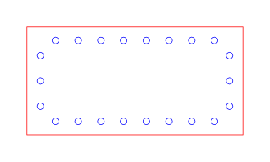

## Rectangle Hole Pattern On Selected Edges

Tests a rectangle with holes only on edges `0` and `2`.

```python
doc = SvgDocument(100, 60)
shape = Rectangle(10, 10, 80, 40)

doc.add_shape(shape, layer="cut")
doc.add_holes(
    shape,
    edges=[0, 2],
    spacing=8.0,
    hole_radius=1.0,
    inset=5.0,
    layer="stitch",
)
```

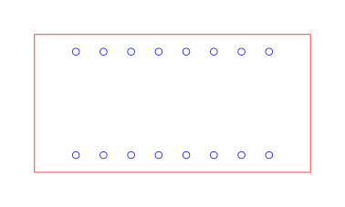

## Rectangle Hole Pattern Including Corners

Tests corner-inclusive hole placement for a rectangle.

```python
doc = SvgDocument(100, 60)
shape = Rectangle(10, 10, 80, 40)

doc.add_shape(shape, layer="cut")
doc.add_holes(
    shape,
    spacing=8.0,
    hole_radius=1.0,
    inset=5.0,
    include_corners=True,
    layer="stitch",
)
```

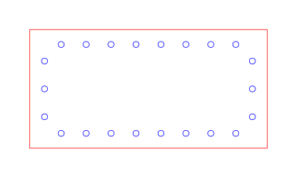

## Rectangle Stitch Pattern At 0 Degrees

Tests short stitch segments aligned with the rectangle edges.

```python
doc = SvgDocument(100, 60)
shape = Rectangle(10, 10, 80, 40)

doc.add_shape(shape, layer="cut")
doc.add_stitch_pattern(
    shape,
    spacing=8.0,
    stitch_length=3.0,
    stitch_angle_deg=0.0,
    inset=5.0,
    layer="stitch",
    stitch_thickness=0.5,
)
```

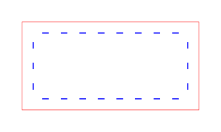

## Rectangle Stitch Pattern At 45 Degrees

Tests the same rectangle stitch layout, but with each stitch rotated by 45 degrees.

```python
doc = SvgDocument(100, 60)
shape = Rectangle(10, 10, 80, 40)

doc.add_shape(shape, layer="cut")
doc.add_stitch_pattern(
    shape,
    spacing=8.0,
    stitch_length=3.0,
    stitch_angle_deg=45.0,
    inset=5.0,
    layer="stitch",
    stitch_thickness=0.5,
)
```

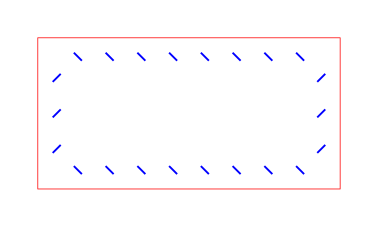

## Rounded Rectangle Hole Pattern

Tests holes distributed around a rounded rectangle contour.

```python
doc = SvgDocument(140, 90)
shape = RoundedRectangle(20, 15, 100, 60, radius=10)

doc.add_shape(shape, layer="cut")
doc.add_holes(
    shape,
    spacing=8.0,
    hole_radius=1.4,
    inset=7.0,
    layer="stitch",
)
```

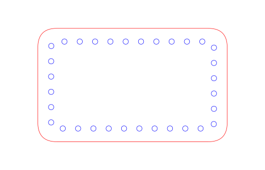

## Rounded Rectangle Partial Stitch Pattern

Tests angled stitches only on edges `1`, `2`, and `3` of a rounded rectangle.

```python
doc = SvgDocument(140, 90)
shape = RoundedRectangle(20, 15, 100, 60, radius=10)

doc.add_shape(shape, layer="cut")
doc.add_stitch_pattern(
    shape,
    edges=[1, 2, 3],
    spacing=8.0,
    stitch_length=3.5,
    stitch_angle_deg=45.0,
    inset=7.0,
    layer="stitch",
    stitch_thickness=0.8,
)
```

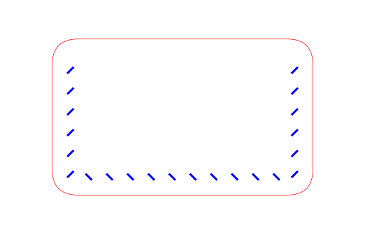

## Per-Corner Rounded Rectangle Stitch Pattern

Tests stitches following an asymmetric contour: rounded top corners, sharp bottom corners.

```python
doc = SvgDocument(140, 90)
shape = RoundedRectangle(20, 15, 100, 60, radius=0,
                         radius_tl=20, radius_tr=20, radius_br=0, radius_bl=0)

doc.add_shape(shape, layer="cut")
doc.add_stitch_pattern(
    shape,
    spacing=6.0,
    stitch_length=3.0,
    inset=5.0,
    layer="stitch",
    stitch_thickness=0.8,
)
```

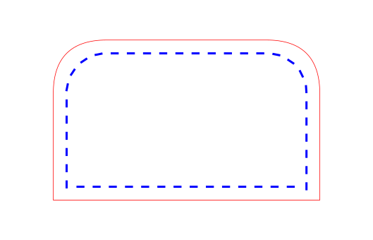

## Per-Corner Rounded Rectangle Hole Pattern

Tests holes on a mixed contour: uniform radius with one sharp and one extra-large corner.

```python
doc = SvgDocument(140, 90)
shape = RoundedRectangle(20, 15, 100, 60, radius=10, radius_bl=0, radius_tr=25)

doc.add_shape(shape, layer="cut")
doc.add_holes(
    shape,
    spacing=8.0,
    hole_radius=1.4,
    inset=6.0,
    layer="stitch",
)
```

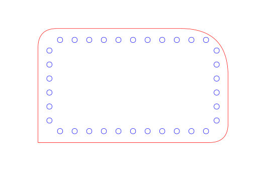

## Stadium Stitch Pattern

Tests stitch segments following the full capsule contour, including both semicircular caps.

```python
doc = SvgDocument(140, 60)
shape = Stadium(10, 15, 120, 30)

doc.add_shape(shape, layer="cut")
doc.add_stitch_pattern(
    shape,
    spacing=5.0,
    stitch_length=3.0,
    inset=4.0,
    layer="stitch",
    stitch_thickness=0.8,
)
```

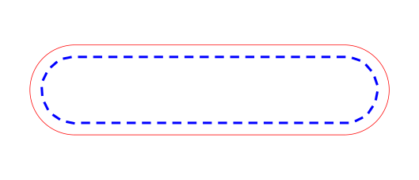

## Stadium Hole Pattern

Tests evenly spaced holes around the capsule contour.

```python
doc = SvgDocument(140, 60)
shape = Stadium(10, 15, 120, 30)

doc.add_shape(shape, layer="cut")
doc.add_holes(
    shape,
    spacing=8.0,
    hole_radius=1.5,
    inset=5.0,
    layer="stitch",
)
```

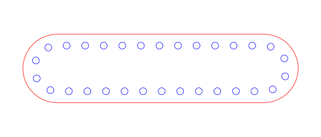

## Vertical Stadium Stitch Pattern

Tests that a tall bounding box places the semicircular caps on the top and bottom.

```python
doc = SvgDocument(60, 140)
shape = Stadium(15, 10, 30, 120)

doc.add_shape(shape, layer="cut")
doc.add_stitch_pattern(
    shape,
    spacing=5.0,
    stitch_length=3.0,
    inset=4.0,
    layer="stitch",
    stitch_thickness=0.8,
)
```

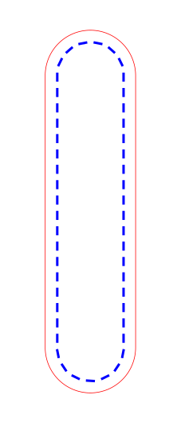

## Circle Hole Pattern

Tests evenly spaced holes around a circular path.

```python
doc = SvgDocument(100, 100)
shape = Circle(50, 50, 35)

doc.add_shape(shape, layer="cut")
doc.add_holes(
    shape,
    spacing=8.0,
    hole_radius=1.5,
    inset=7.0,
    layer="stitch",
)
```

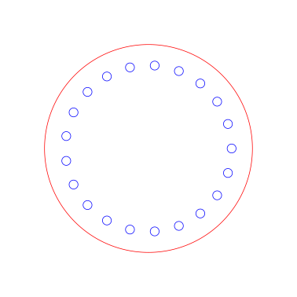

## Circle Stitch Pattern At 0 Degrees

Tests flat stitch segments distributed around a circle.

```python
doc = SvgDocument(100, 100)
shape = Circle(50, 50, 35)

doc.add_shape(shape, layer="cut")
doc.add_stitch_pattern(
    shape,
    spacing=8.0,
    stitch_length=3.5,
    stitch_angle_deg=0.0,
    inset=7.0,
    layer="stitch",
    stitch_thickness=0.8,
)
```

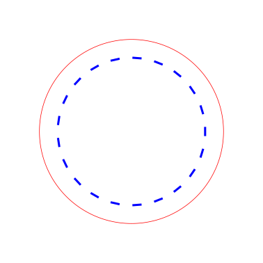

## Circle Stitch Pattern At 45 Degrees

Tests rotated stitch segments around the same circular path.

```python
doc = SvgDocument(100, 100)
shape = Circle(50, 50, 35)

doc.add_shape(shape, layer="cut")
doc.add_stitch_pattern(
    shape,
    spacing=8.0,
    stitch_length=3.5,
    stitch_angle_deg=45.0,
    inset=7.0,
    layer="stitch",
    stitch_thickness=0.8,
)
```

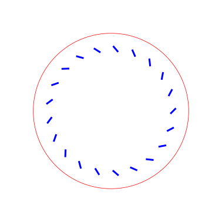

## Ellipse Hole Pattern

Tests evenly spaced holes along the elliptical contour.

```python
doc = SvgDocument(130, 90)
shape = Ellipse(65, 45, 55, 35)

doc.add_shape(shape, layer="cut")
doc.add_holes(
    shape,
    spacing=8.0,
    hole_radius=1.5,
    inset=7.0,
    layer="stitch",
)
```

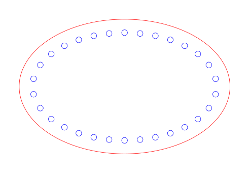

## Ellipse Stitch Pattern

Tests stitch segments distributed evenly along the elliptical contour.

```python
doc = SvgDocument(130, 90)
shape = Ellipse(65, 45, 55, 35)

doc.add_shape(shape, layer="cut")
doc.add_stitch_pattern(
    shape,
    spacing=6.0,
    stitch_length=3.0,
    inset=5.0,
    layer="stitch",
    stitch_thickness=0.8,
)
```

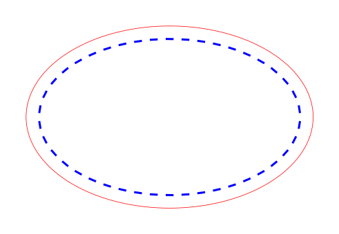

## Triangle Hole Pattern On All Edges

Tests holes around a triangle created from explicit points.

```python
doc = SvgDocument(120, 90)
shape = Triangle(Point(60, 10), Point(110, 80), Point(10, 80))

doc.add_shape(shape, layer="cut")
doc.add_holes(
    shape,
    spacing=8.0,
    hole_radius=1.2,
    inset=6.0,
    layer="stitch",
)
```

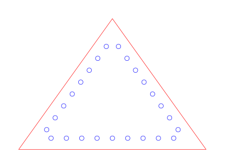

## Triangle Hole Pattern On Selected Edges

Tests a triangle with holes only on two of its edges.

```python
doc = SvgDocument(120, 90)
shape = Triangle(Point(60, 10), Point(110, 80), Point(10, 80))

doc.add_shape(shape, layer="cut")
doc.add_holes(
    shape,
    edges=[0, 2],
    spacing=8.0,
    hole_radius=1.2,
    inset=6.0,
    layer="stitch",
)
```

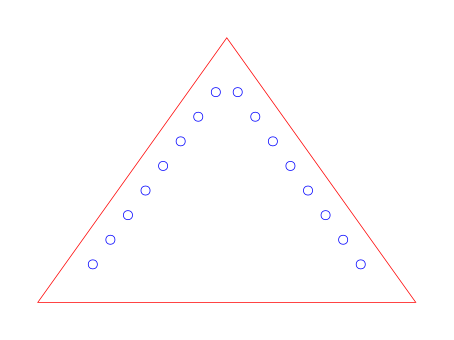

## Triangle Stitch Pattern At 45 Degrees

Tests angled stitch segments along the triangle outline.

```python
doc = SvgDocument(120, 90)
shape = Triangle(Point(60, 10), Point(110, 80), Point(10, 80))

doc.add_shape(shape, layer="cut")
doc.add_stitch_pattern(
    shape,
    spacing=8.0,
    stitch_length=3.5,
    stitch_angle_deg=45.0,
    inset=6.0,
    layer="stitch",
    stitch_thickness=0.8,
)
```

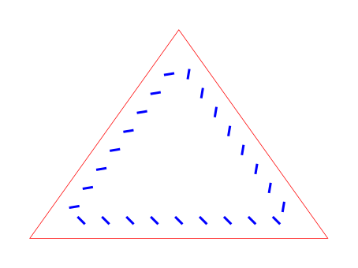

## Rounded Triangle Hole Pattern On Straight Insets

Tests a rounded triangle while keeping hole placement on the straight inset interpretation of the parent triangle path.

```python
doc = SvgDocument(130, 100)
shape = RoundedTriangle(
    Point(65, 10),
    Point(120, 90),
    Point(10, 90),
    radius=12,
)

doc.add_shape(shape, layer="cut")
doc.add_holes(
    shape,
    spacing=8.0,
    hole_radius=1.5,
    inset=6.0,
    layer="stitch",
    rounded_path=False,
)
```


## Rounded Triangle Hole Pattern On Rounded Path

Tests hole placement that follows the rounded triangle contour instead of the straight-edge fallback.

```python
doc = SvgDocument(130, 100)
shape = RoundedTriangle(
    Point(65, 10),
    Point(120, 90),
    Point(10, 90),
    radius=12,
)

doc.add_shape(shape, layer="cut")
doc.add_holes(
    shape,
    spacing=8.0,
    hole_radius=1.5,
    inset=6.0,
    layer="stitch",
    rounded_path=True,
)
```

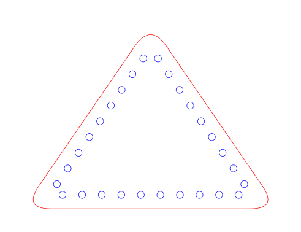

## Rounded Triangle Stitch Pattern On Rounded Path

Tests stitch segments following the rounded triangle contour.

```python
doc = SvgDocument(130, 100)
shape = RoundedTriangle(
    Point(65, 10),
    Point(120, 90),
    Point(10, 90),
    radius=12,
)

doc.add_shape(shape, layer="cut")
doc.add_stitch_pattern(
    shape,
    spacing=8.0,
    stitch_length=3.5,
    stitch_angle_deg=0.0,
    inset=6.0,
    layer="stitch",
    stitch_thickness=0.8,
    rounded_path=True,
)
```

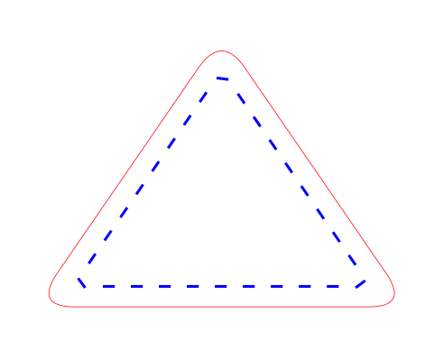
